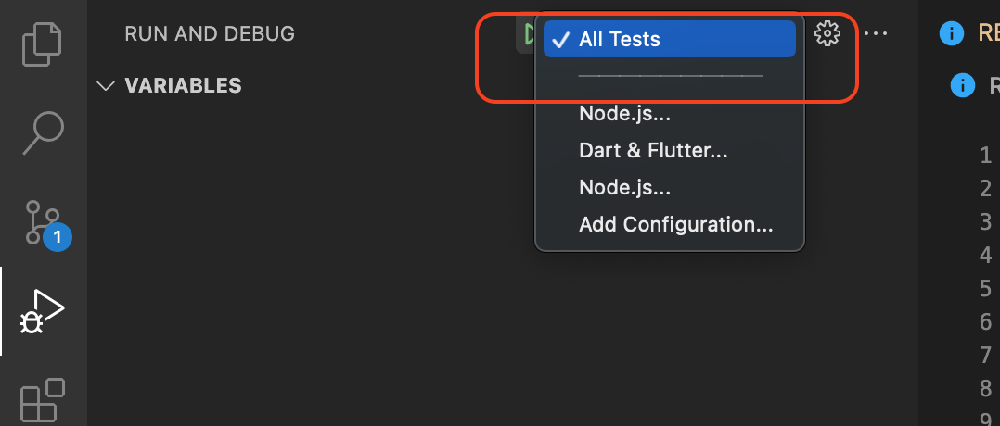

# IPrice CLI test

A sample command-line application with an entrypoint in `bin/`, library code
in `lib/`, and example unit test in `test/`.

**Noted**: Csv file, exe file and mockito file for unit test is added in gitignore. You can generate all these by following [development](#development) section and [build machine code](#build-machine-code) section

---

## Features

Refer [Output](#output) section for results.

1. Convert text entered to uppercase
2. Convert text entered to lowercase
3. Transform text entered by character to uppercase or lowercase
4. Generated simple csv file
5. Exit console
6. Back to main menu when selecting wrong actions
7. Error handling for invalid text and invalid transform action

---

## Development

**Required Dart version:**

```bash
Dart SDK version: 2.15.1
```

1. Run `dart pub run build_runner build --delete-conflicting-outputs` to generate mock class for unit test
2. Run `dart run bin/main.dart` to run the cli app
3. For run test, run `dart run test` or using vscode to look for this screenshot options 

---

## Build Machine Code

1. Run `dart compile exe bin/main.dart` to build the program
2. Run `time bin/main.exe` to execute the program

---

## Output

1. [Video Preview](https://drive.google.com/file/d/1cJc5-_SkEa7EACBIHsjLtUvWQnh6Xzmt/view?usp=sharing)
